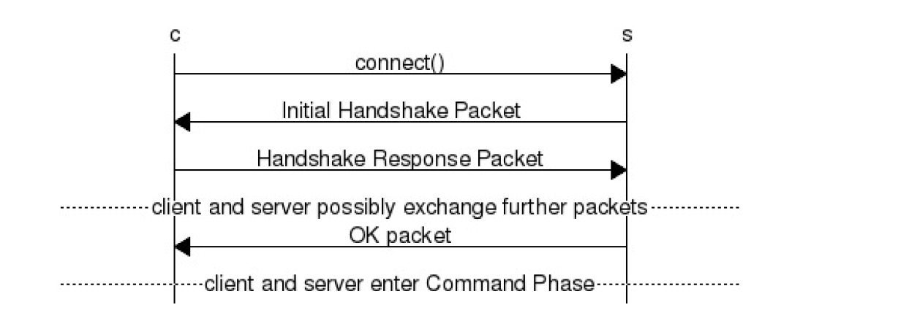
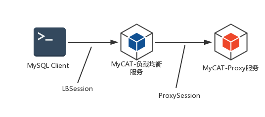

> 注：本文基于MyCAT2 alpha版发布稍后的一个版本进行分析，commitid: d8294ffcda2dd17a6a66f3123dfb962f0efa8abe

## 1.功能说明
MyCAT集群启动后，就需要在集群前面搭一个负载均衡服务供客户端连接，来自客户端的请求被负载均衡服务路由到后端的集群节点。MyCAT2.0开始，负载均衡也由MyCAT自身提供。负载均衡服务就是mysql客户端和后端cluster服务之间的一个中间层，前面对客户端维持着长连接，后面与cluster服务也维持着长连接。把客户端的请求路由到后边的cluster服务。

### 逻辑架构


负载均衡服务根据某种可配置的算法（如random，roundrobin等）将请求报文路由到某个cluster节点，cluster节点再把报文透传到对应的proxy服务，例如leader-1中的9066端口的cluster服务透传到8066端口的proxy服务，然后proxy服务再到后端mysql去执行命令。

上图的MyCAT集群中有3组节点，分别是leader-1，leader-2，leader-3；以leader-1为例，这里虽然有2个服务，但实际上它们属于同一个进程，只不过开了两个端口。7066端口的负载均衡服务负责与mysql客户端交互，它实际上也是跟cluster和proxy服务属于同一个进程的（例如同属于leader-1）。

## 2.源码分析

### 2.1 开启监听

[《MyCAT2新特性之自动集群》](../MyCAT2.0集群/MyCAT集群.md)一文中，leader-1节点开启了负载均衡，如下。

* balancer.yml

```
balancer:
  enable: true
  ip: 0.0.0.0
  port: 7066
  strategy: RANDOM
```

那负载均衡服务是在什么时候开启的呢？答案是leader-1成为主节点时，在启动proxy服务的时候一并启动了负载均衡服务。以下是ProxyStarter.startProxy方法中启动负载均衡的代码。

```
// 集群模式下才开启负载均衡服务
if (clusterBean.isEnable() && balancerBean.isEnable()) {
	runtime.getAcceptor().startServerChannel(balancerBean.getIp(), balancerBean.getPort(), ServerType.LOAD_BALANCER);
}
```

再看NIOAcceptor的startServerChannel方法。

```
public boolean startServerChannel(String ip, int port, ServerType serverType) throws IOException {
	...
	if (serverType == ServerType.CLUSTER) {
		adminSessionMan = new DefaultAdminSessionManager();
		ProxyRuntime.INSTANCE.setAdminSessionManager(adminSessionMan);
		logger.info("opend cluster conmunite port on {}:{}", ip, port);
	} else if (serverType == ServerType.LOAD_BALANCER){
		logger.info("opend load balance conmunite port on {}:{}", ip, port);
		ProxyRuntime.INSTANCE.setProxySessionSessionManager(new ProxySessionManager());
		ProxyRuntime.INSTANCE.setLbSessionSessionManager(new LBSessionManager());
	}

	openServerChannel(selector, ip, port, serverType);
	return true;
}
```

程序来到 *else if (serverType == ServerType.LOAD_BALANCER)* 分支，在运行时上下文中设置好ProxySessionManager和LBSessionManager。然后调用openServerChannel方法开启监听。

```
private void openServerChannel(Selector selector, String bindIp, int bindPort, ServerType serverType)
			throws IOException {
		final ServerSocketChannel serverChannel = ServerSocketChannel.open();
		final InetSocketAddress isa = new InetSocketAddress(bindIp, bindPort);
		serverChannel.bind(isa);
		serverChannel.configureBlocking(false);
		serverChannel.setOption(StandardSocketOptions.SO_REUSEADDR, true);
		serverChannel.register(selector, SelectionKey.OP_ACCEPT, serverType);
		if (serverType == ServerType.CLUSTER) {
			logger.info("open cluster server port on {}:{}", bindIp, bindPort);
			clusterServerSocketChannel = serverChannel;
		} else if (serverType == ServerType.LOAD_BALANCER) {
			logger.info("open load balance server port on {}:{}", bindIp, bindPort);
			loadBalanceServerSocketChannel = serverChannel;
		} else {
			logger.info("open proxy server port on {}:{}", bindIp, bindPort);
			proxyServerSocketChannel = serverChannel;
		}
	}
```

先打开一个ServerSocketChannel，绑定ip和port,把serverChannel设置为非阻塞模式，并把channel注册到NIOAcceptor的selector上，关注Accept事件，把serverType即ServerType.LOAD_BALANCER 附加（attach）到该channel上。

### 2.2 响应客户端连接

现在，用mysql client向负载均衡服务发起连接请求，如通过下面的命令。
> mysql -h127.0.0.1 -uroot -P7066 -p123456

TCP连接建立后，负载均衡服务会收到accept事件。（关于NIOAcceptor线程是何时启动的，是如何轮询selector并处理IO事件的，已在[《MyCAT2新特性之自动集群》](../MyCAT2.0集群/MyCAT集群.md)一文的NIOAcceptor一节有讨论，这里不再赘述）下面直接讲述收到accept事件后是如何处理的。

#### NIOAcceptor#processAcceptKey

```
protected void processAcceptKey(ReactorEnv reactorEnv, SelectionKey curKey) throws IOException {
		ServerSocketChannel serverSocket = (ServerSocketChannel) curKey.channel();
		// 接收通道，设置为非阻塞模式
		final SocketChannel socketChannel = serverSocket.accept();
		socketChannel.configureBlocking(false);
		logger.info("new Client connected: " + socketChannel);
		ServerType serverType = (ServerType) curKey.attachment();
		ProxyRuntime proxyRuntime = ProxyRuntime.INSTANCE;
		// 获取附着的标识，即得到当前是否为集群通信端口
		if (serverType == ServerType.CLUSTER) {
			adminSessionMan.createSession(null, this.bufPool, selector, socketChannel, true);
		} else if (serverType == ServerType.LOAD_BALANCER &&
				   proxyRuntime.getMyCLuster() != null &&
                   proxyRuntime.getMyCLuster().getClusterState() == ClusterState.Clustered) {
			BalancerConfig balancerConfig = proxyRuntime.getConfig().getConfig(ConfigEnum.BALANCER);
			LoadBalanceStrategy loadBalanceStrategy =
					LBStrategyConfig.getStrategy(balancerConfig.getBalancer().getStrategy());
			ClusterNode theNode = loadBalanceStrategy.getNode(proxyRuntime.getMyCLuster().allNodes.values(), null);
			String myId = proxyRuntime.getMyCLuster().getMyNodeId();
			if (theNode.id.equals(myId)) {
				logger.debug("load balancer accepted. Dispatch to local");
				accept(reactorEnv, socketChannel, serverType);
			} else {
				logger.debug("load balancer accepted. Dispatch to remote");
				ProxyReactorThread<?> proxyReactor = getProxyReactor(reactorEnv);
				proxyReactor.addNIOJob(() -> {
					try {
						LBSession lbSession = ProxyRuntime.INSTANCE.getLbSessionSessionManager()
																   .createSession(null, proxyReactor.bufPool,
																				  proxyReactor.getSelector(),
																				  socketChannel, false);
						lbSession.getCurNIOHandler().onConnect(curKey, lbSession, true, null);
					} catch (IOException e) {
						logger.warn("load balancer accepted error:", e);
					}
				});
			}
		} else {
			accept(reactorEnv,socketChannel,serverType);
		}
	}
```

程序会来到 ***else if (serverType == ServerType.LOAD_BALANCER &&
                   proxyRuntime.getMyCLuster() != null &&
                   proxyRuntime.getMyCLuster().getClusterState() == ClusterState.Clustered)*** 分支。首先获取负载均衡配置BalancerConfig，根据配置策略如RANDOM，去选出一个clusernode。如下

> ClusterNode theNode = loadBalanceStrategy.getNode(proxyRuntime.getMyCLuster().allNodes.values(), null);

如果选中的clusernode恰好是当前节点，则连接由本地的proxy服务处理。如果选中的是其他节点，则把连接分发到其他节点。所谓分发，其实就是负载均衡服务所在的节点去连接其他集群节点的proxy服务。下面详细分析。

#### 连接分发给本地

选中了当前节点，则程序走下面的分支。

```
if (theNode.id.equals(myId)) {
    logger.debug("load balancer accepted. Dispatch to local");
    accept(reactorEnv, socketChannel, serverType);
} 
```

```
private void accept(ReactorEnv reactorEnv,SocketChannel socketChannel,ServerType serverType) throws IOException {
	// 找到一个可用的NIO Reactor Thread，交付托管
	ProxyReactorThread<?> nioReactor = getProxyReactor(reactorEnv);
	// 将通道注册到reactor对象上
	nioReactor.acceptNewSocketChannel(serverType, socketChannel);
}
```

accept方法获取一个可用的Reactor线程（是一个MycatReactorThread，不是NIOAcceptor），将通道socketChannel和Reactor线程关联在一起。也就是把这个socketChannel交给这个Reactor线程处理，这个channel上后续的读写事件跟NIOAcceptor就没什么关系了，NIOAcceptor继续只处理connect事件。

> Reactor线程组的线程是在启动proxy服务时启动的，线程的数量等于cpu核数。线程类型是MycatReactorThread，跟NIOAcceptor一样，都是ProxyReactorThread的子类。

再来看MycatReactorThread的acceptNewSocketChannel方法。

```
public void acceptNewSocketChannel(Object keyAttachement, final SocketChannel socketChannel) throws IOException {
	pendingJobs.offer(() -> {
		try {
			T session = sessionMan.createSession(keyAttachement, this.bufPool, selector, socketChannel, true);
			allSessions.add(session);
		} catch (Exception e) {
			logger.warn("regist new connection err " + e);
		}
	});
}
```

往该Reator线程的NIO任务队列pendingJobs中塞一个Runnable任务。Reactor线程会在没有IO事件处理的间隙处理这些任务。再来看看这个任务做了什么。sessionMan.createSession，创建了一个session会话。确切的说，是MycatSessionManager创建了一个MycatSession。下面是MycatSessionManager的createSession方法。

```
public MycatSession createSession(Object keyAttachment, BufferPool bufPool, Selector nioSelector,
		SocketChannel frontChannel, boolean isAcceptCon) throws IOException {
	logger.info("MySQL client connected  ." + frontChannel);
	MycatSession session = new MycatSession(bufPool, nioSelector, frontChannel);
	// 第一个IO处理器为Client Authorware
	session.setCurNIOHandler(MySQLClientAuthHandler.INSTANCE);
	// 默认为透传命令模式
	//session.curSQLCommand = DirectPassthrouhCmd.INSTANCE;
	// 向MySQL Client发送认证报文
	session.sendAuthPackge();
	session.setSessionManager(this);
	allSessions.add(session);
	return session;
}
```
主要做了几件事：

* 创建MycatSession实例。MycatSession 是一个前端连接会话的抽象，它代表mysql客户端和mycat服务的一个连接。
* 设置MycatSession的当前NIOHandler为MySQLClientAuthHandler。因为MycatSession马上就要发送握手报文给mysql客户端，所以先把session的NIOHandler设置为MySQLClientAuthHandler。
* 向mysql client发送握手数据包 session.sendAuthPackge()。

这里有必要说一下为什么MycatSession要给mysql client发握手数据包。因为对client来说，mycat就是一个mysql server。所以mycat要遵循mysql client/server连接时的握手和认证过程。下面来看下mysql client和server在连接时发生了什么。

##### mysql连接阶段



连接阶段一共4步：

1. client端发起连接。
2. server端向client端发送握手数据包
3. client端发送认证信息（user和password）到server端
4. server端响应认证结果，OK packet 或者 ERR packet。

客户端收到握手数据包后向服务端发送认证信息，且看下服务端收到认证信息后如何处理。从上面分析知道，此时MycatSession的NIOHandler为MySQLClientAuthHandler。所以收到Read事件后，MycatSession将会委派MySQLClientAuthHandler处理，下面是MySQLClientAuthHandler的onSocketRead方法。

```
public void onSocketRead(MycatSession session) throws IOException {
		ProxyBuffer frontBuffer = session.getProxyBuffer();
		if (session.readFromChannel() == false
				|| CurrPacketType.Full != session.resolveMySQLPackage(frontBuffer, session.curMSQLPackgInf, false)) {
			return;
		}

		// 处理用户认证报文
		try {
			AuthPacket auth = new AuthPacket();
			auth.read(frontBuffer);

			MycatConfig config = ProxyRuntime.INSTANCE.getConfig();
			UserConfig userConfig = config.getConfig(ConfigEnum.USER);
			UserBean userBean = null;
			for (UserBean user : userConfig.getUsers()) {
				if (user.getName().equals(auth.user)) {
					userBean = user;
					break;
				}
			}

			// check user
			if (!checkUser(session, userConfig, userBean)) {
				failure(session, ErrorCode.ER_ACCESS_DENIED_ERROR, "Access denied for user '" + auth.user + "' with addr '" + session.addr + "'");
				return;
			}

			// check password
			if (!checkPassword(session, userBean, auth.password)) {
				failure(session, ErrorCode.ER_ACCESS_DENIED_ERROR, "Access denied for user '" + auth.user + "', because password is error ");
				return;
			}

			// check degrade
//			if (isDegrade(auth.user)) {
//				failure(ErrorCode.ER_ACCESS_DENIED_ERROR, "Access denied for user '" + auth.user + "', because service be degraded ");
//				return;
//			}

			// check schema
			switch (checkSchema(userBean, auth.database)) {
				case ErrorCode.ER_BAD_DB_ERROR:
					failure(session, ErrorCode.ER_BAD_DB_ERROR, "Unknown database '" + auth.database + "'");
					break;
				case ErrorCode.ER_DBACCESS_DENIED_ERROR:
					String s = "Access denied for user '" + auth.user + "' to database '" + auth.database + "'";
					failure(session, ErrorCode.ER_DBACCESS_DENIED_ERROR, s);
					break;
				default:
					// set schema
					if (auth.database == null) {
						session.schema = (userBean.getSchemas() == null) ?
								config.getDefaultSchemaBean() : config.getSchemaBean(userBean.getSchemas().get(0));
					} else {
						session.schema = config.getSchemaBean(auth.database);
					}

					logger.debug("set schema: {} for user: {}", session.schema, auth.user);
					if (success(session, auth)) {
						session.proxyBuffer.reset();
						session.answerFront(AUTH_OK);
						// 认证通过，设置当前SQL Handler为默认Handler
						session.setCurNIOHandler(DefaultMycatSessionHandler.INSTANCE);
					}
			}
		} catch (Throwable e) {
			logger.warn("Frontend FrontendAuthenticatingState error:", e);
		}
	}

```

收到认证报文后，使用checkUser，checkPassword等方法进行认证，如果认证成功，则返回OK报文，并将NIOHandler设为DefaultMycatSessionHandler。

> 这里限于篇幅暂不分析MyCAT 如何解析报文，如何生成挑战数如何利用挑战数去对比password等。

至此，负载均衡服务选中当前节点来接收和响应请求。mysql client通过负载均衡器与Mycat服务端之间的连接已成功建立。

#### 连接分发给其他集群节点

如果负载均衡服务选中的是其他节点，则程序走下面的分支。

```
else {
	logger.debug("load balancer accepted. Dispatch to remote");
	ProxyReactorThread<?> proxyReactor = getProxyReactor(reactorEnv);
	proxyReactor.addNIOJob(() -> {
		try {
			LBSession lbSession = ProxyRuntime.INSTANCE.getLbSessionSessionManager()
													   .createSession(null, proxyReactor.bufPool,
																	  proxyReactor.getSelector(),
																	  socketChannel, false);
			lbSession.getCurNIOHandler().onConnect(curKey, lbSession, true, null);
		} catch (IOException e) {
			logger.warn("load balancer accepted error:", e);
		}
	});
}
```

获取一个可用的Reactor线程,往该Reator线程的NIO任务队列pendingJobs中塞一个Runnable任务。该任务做了两件事。

* 第一件事是创建一个LBSession。它是负载均衡器前端会话的一个抽象，代表mysql client和负载均衡服务的一个连接。

下面是LBSessionManager的createSession方法。

```
public LBSession createSession(Object keyAttachement, BufferPool bufPool, Selector nioSelector,
                                  SocketChannel channel, boolean isAcceptedCon) throws IOException {
    LBSession lbSession = new LBSession(bufPool,nioSelector,channel);
    lbSession.setCurNIOHandler(getDefaultSessionHandler());
    allSession.add(lbSession);
    return lbSession;
}
```
首先实例化一个LBSession，然后设置LBSession的当前NIOHandler为LBNIOHandler。

* 第二件事是调用LBSession的onConnect方法,去连接选中的集群的proxy服务。

下面是LBNIOHandler的onConnect方法。

```
public void onConnect(SelectionKey curKey, LBSession session, boolean success, String msg) throws IOException {
    ProxyRuntime runtime = ProxyRuntime.INSTANCE;
    MyCluster cluster = runtime.getMyCLuster();
    BalancerConfig balancerConfig = runtime.getConfig().getConfig(ConfigEnum.BALANCER);
    LoadBalanceStrategy loadBalanceStrategy =
            LBStrategyConfig.getStrategy(balancerConfig.getBalancer().getStrategy());
    ClusterNode clusterNode = loadBalanceStrategy.getNode(cluster.allNodes.values(), null);
    connectToRemoteMycat(clusterNode.ip, clusterNode.proxyPort, runtime.getAcceptor().getSelector(), session);
}
```

再次根据配置的负载均衡策略去选取一个cluserNode，然后调用connectToRemoteMycat去连接远端集群节点的proxy服务。

> 这里再次选取一个clusernode的做法存在一个问题：它没有排除掉当前节点。也就是有可能选中了当前节点，变成了自己跟自己做了一次连接，不是负载均衡的初衷。选取时应该把当前节点排除掉。

继续看connectToRemoteMycat方法。

```
private void connectToRemoteMycat(String ip, int port, Selector selector, LBSession lbSession) throws IOException {
    logger.info("load balancer dispatch connection to {}:{}", ip, port);
    InetSocketAddress address = new InetSocketAddress(ip, port);
    SocketChannel sc = SocketChannel.open();
    sc.configureBlocking(false);
    sc.register(selector, SelectionKey.OP_CONNECT, lbSession);
    sc.connect(address);
}
```
connectToRemoteMycat这里值得注意的有两点：

* 一是该方法的selector入参是 ***runtime.getAcceptor().getSelector()***，也就是连接对应的socketChannel注册到NIOAcceptor的多路复用器上。所以该连接一旦建立，connect事件将由NIOAcceptor处理。
* 二是 ***sc.register(selector, SelectionKey.OP_CONNECT, lbSession)***，注册到多路复用器时attachment是LBSession。

##### 负载均衡器本地响应Connect事件

来看看NIOAcceptor的processConnectKey方法。连接远端proxy服务成功后，当前节点会收到connect事件。程序会走 ***if (obj != null && obj instanceof LBSession)*** 分支。

```
protected void processConnectKey(ReactorEnv reactorEnv, SelectionKey curKey) throws IOException {
		// only from cluster server socket
		SocketChannel curChannel = (SocketChannel) curKey.channel();
		Object obj = curKey.attachment();
		try {
			if (curChannel.finishConnect()) {
				if (obj != null && obj instanceof LBSession) {
					//负载均衡器连接远程mycat
					ProxyReactorThread<?> proxyReactor = getProxyReactor(reactorEnv);
					proxyReactor.addNIOJob(() -> {
						try {
							ProxySession proxySession = ProxyRuntime.INSTANCE.getProxySessionSessionManager()
																			 .createSession(null, proxyReactor.bufPool,
																							proxyReactor.getSelector(),
																							curChannel, false);
							LBSession lbSession = (LBSession) obj;
							proxySession.setLbSession(lbSession);
							lbSession.setProxySession(proxySession);
							proxySession.getCurNIOHandler().onConnect(curKey, proxySession, true, null);
						} catch (Exception e) {
							logger.warn("Load balancer connect remote mycat error:",e);
						}
					});
				} else {
					...
				}
			}

		} catch (ConnectException ex) {
			...	
		}
	}


```

获取一个可用的Reactor线程,往该Reator线程的NIO任务队列pendingJobs中塞一个Runnable任务。该任务主要做两件事：

* 创建一个ProxySession。它是一个负载均衡器后端会话的抽象，代表负载均衡服务和Proxy服务的连接。
* 把LbSession和ProxySession互相关联起来，表示一条从mysql client->loadbalance->proxy的逻辑连接成功建立。

##### 远端Proxy服务响应accept事件

另一方面，连接远端proxy服务的TCP建立成功后，远端的MyCAT proxy服务将收到accept事件。该事件由NIOAcceptor处理。

```
protected void processAcceptKey(ReactorEnv reactorEnv, SelectionKey curKey) throws IOException {
		ServerSocketChannel serverSocket = (ServerSocketChannel) curKey.channel();
		// 接收通道，设置为非阻塞模式
		final SocketChannel socketChannel = serverSocket.accept();
		socketChannel.configureBlocking(false);
		logger.info("new Client connected: " + socketChannel);
		ServerType serverType = (ServerType) curKey.attachment();
		ProxyRuntime proxyRuntime = ProxyRuntime.INSTANCE;
		// 获取附着的标识，即得到当前是否为集群通信端口
		if (serverType == ServerType.CLUSTER) {
			...
		} else if (serverType == ServerType.LOAD_BALANCER &&
				   proxyRuntime.getMyCLuster() != null &&
                   proxyRuntime.getMyCLuster().getClusterState() == ClusterState.Clustered) {
			...		
		} else {
			accept(reactorEnv,socketChannel,serverType);
		}
	}

```
由于连接的是proxy服务，其ServerType是ServerType.Proxy。所以程序走else分支

```
else {
	accept(reactorEnv,socketChannel,serverType);
}
```

后续的步骤就跟“连接分发给本地”一节的一样 -- mycat proxy服务发送握手报文给mysql client，然后进行认证等等。如下图所示，分发到远端proxy服务的场景，其连接视图是这样的。



## 3.小结和展望

本文主要分析了MyCAT2.0负载均衡的实现原理。从响应客户端连接的角度详细解释了负载均衡器如何路由，如何建立连接，如何模拟mysql服务端与mysql客户端进行握手认证等等。

分析过程中我们知道当前版本的负载均衡服务跟集群服务是在同一个进程里的，这会导致我们重启某个集群节点时，负载均衡服务也会挂掉。不太好。后续版本MyCAT社区会考虑把负载均衡服务剥离出去。